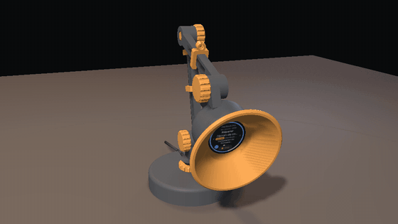

# λ Harness C3

[](https://github.com/Silexperience210/harness-c3/actions/workflows/build.yml)
[](https://silexperience210.github.io/harness-c3/webflasher/)

A USB companion dial for the [Harness](https://github.com/autonomous-ai/openharness)
daemon, ported from the reference ESP32-S3 dial to the low-cost
**ESP32-2424S012C / ESP32-2424S012C-I** (ESP32-C3-MINI-1U + 1.28″ GC9A01
240×240 round IPS + CST816D capacitive touch). Plug it into the computer
running the daemon: it shows what each coding agent is doing, lets you answer
their questions with a tap, stop a runaway turn, and scroll the window.

*Section française plus bas.* 🇫🇷

## What it does

- **Agent carousel** — a status ring per agent (grey idle / blue working /
  amber waiting / green done / red error), name, a coloured engine pill +
  machine, the live status line, page dots and the account-wide fleet badge.
  It moves: a comet circles the ring while a turn runs (with a turn timer,
  "Working · 1:23"), the ring fills green when a turn finishes, the card
  shakes on an error and slides in from the side you swiped; toasts glide,
  question options arrive in a cascade, the backlight fades. Every effect
  repaints only what changes (see `ui.c`, *effects*).
- **Questions** (AskUserQuestion) take the face: tap an option (or several
  for multi-select), then ✓. Dismiss with ✕ or a sideways swipe — the
  question stays pending and an amber chip on the home screen brings it
  back. Up to three questions queue; several items per request are walked
  one by one. A **free-text** question (no options) offers the ready-made
  replies below instead; the one you pick is sent as its answer.
- **Stop** a running turn (tap *Stop*, then *Confirm?*) — `turn.stop`.
- **Follow up** (*Relancer*) an agent that finished, failed or sits idle,
  with nothing waiting on it: the chip where *Stop* sits opens the agent's
  last recap and 4–5 ready-made replies; pick one, then ✓ — `turn.send`, a
  new turn. A toast confirms it; if no turn starts within 10 s, a second one
  says *No reaction*. Never during a turn (the chip is *Stop* then), and only
  for engines whose delivery was checked end to end (Claude Code, Hermes —
  `HARNESS_RELAUNCH_ENGINES`). The daemon types the text into the agent's
  terminal and presses Enter: anything half typed there goes along with it,
  and a reply starting with `/` is a command to the engine.
- **Scrollpad** — the dial becomes a touchpad that scrolls the computer's
  window (`scroll` with fling velocity).
- **Finished turns** and **errors** pop up as toasts (the board has no
  buzzer), and each leaves a **flag** on the agent's card — a green disc for
  work that finished, red for a turn that failed — until that card is
  touched: the toast lasts three seconds, and a desk you walked away from
  should still say what happened. The agent's page dot takes the same colour,
  so you can see which of four agents moved without walking the carousel.
  Left alone for 30 s the dial becomes the lamp (below); the other screens
  dim after 60 s and switch off after 10 min, and a question always wakes
  the screen. A tap on a dark screen only wakes it.
- **Lamp mode** — the dial as a light, for the desk lamp it lives in: a
  radial glow in five tones (candle, warm, neutral, daylight, cool); drag
  ↑↓ for brightness, ←→ for the tone, tap to leave. Never dimmed (only
  switched off after an hour, below), works offline, remembered in NVS; a
  question still takes the face and hands it back, and a dot at 12 o'clock
  shows a running turn (blue), a question (amber) or an error (red).
  **It also comes on by itself**: after 30 s without a touch on the home or
  "Not connected" screen, the dial turns into the lamp (your level and
  tone); a tap gives the face back and the 30 s start over. Never while a
  question waits (on screen, behind the amber chip or in the unread list),
  nor from the settings or scrollpad. Delay: *Screen power → Become a lamp
  after N seconds* (`HARNESS_LAMP_AUTO_AFTER_S`, 0 = never).
  **It does not burn all night**: one hour after the last touch (the switch
  to the lamp is not a touch), the lamp goes dark. A tap wakes it — the
  lamp again, at its level, and a fresh hour; a second tap gives the face
  back. It goes dark **even while a question waits**: the question stays
  queued (the second tap brings the face back with its amber chip), and a
  question that arrives wakes the screen. Delay: *Screen power → Lamp off
  after N seconds* (`HARNESS_LAMP_OFF_AFTER_S`, 3600, 0 = never); the other
  screens keep their own dim / off delays.
  **Any activity gives the face back**: everything the daemon pushes — a
  turn that starts, its status lines, a finished or failed turn, a question
  or one closed elsewhere, the unread list, a toast, the window moving to
  another agent — and the cable link dropping or coming back wake the
  screen and, from the lamp — lit or dark — return to the dial as a tap
  would (your level and tone are kept). A screen switched off by hand (BOOT
  long) comes back too. Once things are calm, the lamp (or the dark) returns
  by itself after its usual delays: it only ever comes from rest or from
  your hand. The daemon's pings, its 15 s keepalive and a plain agent-list
  refill (a tab switch) are not activity.
- **Settings** (pull down): brightness (kept in NVS), firmware / touch chip,
  free RAM, link error counters.
- Speaks the upstream **cable** protocol (binary framing + JSON vocabulary)
  over the ESP32-C3's native USB — no Wi-Fi, no account, no pairing.

| Gesture | Action |
|---|---|
| Swipe ← / → (or tap ‹ ›) | next / previous agent (sends `focus`) |
| Tap the agent card | open it on the computer (`agent.open`) |
| Pull ↓ / push ↑ | settings / scrollpad |
| Hold the card (or the offline screen) | **lamp mode** — also *Settings → Lamp*, or 30 s without a touch |
| BOOT short / long | back · open a waiting question / screen off–on |

## Desk lamp

`hardware/lamp/` — a 3D-printable articulated desk lamp whose bulb is the
dial: 13 parts, no supports, printed screw joints, a vintage bell shade
whose reflector turns the display into the bulb, plus a short assembly &
setup video (FR/EN). See
[hardware/lamp/README.md](hardware/lamp/README.md).

[](https://silexperience210.github.io/harness-c3/lamp/)

**▶ [Watch the assembly & setup video (FR / EN, with sound)](https://silexperience210.github.io/harness-c3/lamp/)** ·
MP4: [français](docs/lamp/harness-c3-lamp-fr.mp4) · [English](docs/lamp/harness-c3-lamp-en.mp4)

## Hardware

Board **ESP32-2424S012C** (sold in a case as **-C-I**). Everything is on the
board; the pin map is the default and needs no wiring:

| Signal | GPIO | Signal | GPIO |
|---|---|---|---|
| LCD SCK / MOSI | 6 / 7 | Touch SDA / SCL | 4 / 5 |
| LCD CS / DC | 10 / 2 | Touch INT / RST | 0 / 1 |
| LCD RST | tied to EN (SW reset) | BOOT button | 9 |
| Backlight (PWM) | 3 | USB D− / D+ | 18 / 19 |

> [!IMPORTANT]
> Use a **USB-A → USB-C** data cable. The board has no CC resistors, so a
> USB-C ↔ USB-C cable does not power it. If the port does not appear for
> flashing, hold **BOOT** while plugging in.

A hand-wired build (bare ESP32-C3 + GC9A01 breakout + two buttons, optional
buzzer) is still supported: `menuconfig → Harness C3 Configuration → Board →
Custom wiring`, then set the pins.

## Flashing

**Web flasher (easiest):** open
<https://silexperience210.github.io/harness-c3/webflasher/> in Chrome/Edge,
click *Connect & Flash*. CI keeps it on the latest `main` build.

**esptool:** grab `harness-c3-merged.bin` from
[Releases](https://github.com/Silexperience210/harness-c3/releases) (or from
the `firmware-bins` artifact of any CI run):

```sh
esptool.py --chip esp32c3 write_flash 0x0 harness-c3-merged.bin
```

**From source (ESP-IDF v5.5):**

```sh
cd firmware
idf.py set-target esp32c3
idf.py build flash monitor
```

### First flash: orientation check

The GC9A01 driver's scan direction differs between panel batches. If the
picture is mirrored or upside down, toggle *Display → Mirror X / Mirror Y*
in menuconfig; if taps land in the wrong place, apply the same transform in
*Touch → mirror / swap*. Both are logged at boot (`display:` / `touch:`).

## Configuration (menuconfig → *Harness C3 Configuration*)

Board, every pin, SPI clock (80 MHz on this board), panel orientation /
colour order, touch transforms, default brightness, dim / off delays, the
automatic lamp delay (`HARNESS_LAMP_AUTO_AFTER_S`, 30 s, 0 = never: dim and
off then work exactly as before), the lamp's own off delay
(`HARNESS_LAMP_OFF_AFTER_S`, 3600 s, 0 = never; the lamp ignores the dim /
off delays), the ready-made replies (`HARNESS_QUICK_REPLIES`, up to 6
separated by `|`, French defaults "Continue|Oui|Non|Résume où tu en es|Lance
les tests"; empty = no *Follow up* chip) and the engines that get the chip
(`HARNESS_RELAUNCH_ENGINES`, "claude|hermes", `*` = all), UI language
(Français / English), max agents held.

## Development

- `firmware/` — ESP-IDF project (target `esp32c3`, dual-OTA 4 MB, LVGL
  **9.2.2** and `esp_lcd_gc9a01` **2.0.4** pinned, `dependencies.lock`
  committed).
- `firmware/test/host/run_tests.sh` — protocol tests on your laptop: every
  shared framing vector, golden JSON for every message, struct-layout check.
- `firmware/test/sim/run_sim.sh` — **UI simulator**: the real `ui.c` +
  `cable_client.c` + LVGL on a virtual round panel, driven by a scripted
  daemon and finger (72 checks); writes a PNG per screen and a contact sheet
  (`out/screens.png`). Needs gcc, python3, Pillow.
- `firmware/scripts/gen_fonts.sh` — regenerates the UI fonts (Latin-1,
  French typography, λ, LVGL symbols) with `lv_font_conv`.
- `PROTOCOL.md` — the normative cable protocol. `SPEC.md` — this port.
- `tools/dial-linux/` — **the dial on Linux**: the Harness desktop app (the only
  thing that publishes the agents the dial may show) is macOS-only, so this
  bridges it locally over loopback (`app_panes` + `app_swarms` on the daemon's
  local socket), plus systemd user units and a `hermes-dial` agent launcher.

## Limits

- No voice (no mic), no machine wheel / swarms / model picker — the
  carousel covers the window's active tab.
- Free-text questions (no options) can only get one of the ready-made
  replies; anything else is typed on the computer.
- *Follow up* is fire and forget: the dial knows a turn started, not that
  the agent read your text the way you meant it. Text half typed in the
  agent's terminal is sent along with the reply (measured on Claude Code and
  Hermes). Codex was not available to test: add it to
  `HARNESS_RELAUNCH_ENGINES` once you have seen it work.
- **`fw.offer` is never answered** (anti-brick, SPEC §9): upstream images
  target ESP32-S3. Dual-OTA partitions and rollback are in place for a
  future C3-aware updater; until then, use the web flasher or esptool.
- Not yet validated on every panel batch — see *orientation check* above.

## Credits

Protocol implementation, framing code, test vectors and the protocol
specification are adapted from
[autonomous-ai/openharness](https://github.com/autonomous-ai/openharness)
(MIT) — see `LICENSE`. Fonts: Montserrat and Font Awesome (SIL OFL 1.1),
DejaVu Sans (λ) — see `firmware/main/fonts/README.md`.

---

# λ Harness C3 — en français

## C'est quoi ?

Un cadran USB compagnon pour le daemon
[Harness](https://github.com/autonomous-ai/openharness), sur la carte
**ESP32-2424S012C / ESP32-2424S012C-I** (ESP32-C3-MINI-1U + écran rond
GC9A01 1,28″ 240×240 + tactile capacitif CST816D). Branché sur l'ordinateur
qui fait tourner le daemon, il montre ce que fait chaque agent de code, et
permet de répondre à ses questions d'un tap, d'arrêter un tour en cours et de
faire défiler la fenêtre.

- **Carrousel d'agents** : anneau de statut coloré (gris inactif / bleu en
  cours / ambre en attente / vert terminé / rouge erreur), nom, pastille
  colorée du moteur + machine, ligne de statut en direct, points de
  pagination, badge du total de la flotte. Et ça bouge : une comète fait le
  tour de l'anneau pendant un tour (avec chrono « En cours · 1:23 »),
  l'anneau se remplit en vert quand le tour finit, la carte secoue la tête
  sur une erreur et glisse du côté du swipe ; toasts, options de question
  en cascade, fondu du rétroéclairage.
- **Questions** : elles prennent l'écran ; touchez une option (ou plusieurs
  en choix multiple) puis ✓. ✕ ou un swipe latéral = « plus tard » : la
  question reste en attente et une pastille ambre sur l'accueil la rouvre.
  Jusqu'à 3 questions en file.
  Une question à **réponse libre** (sans options) propose à la place les
  réponses toutes faites ci-dessous ; celle choisie part comme sa réponse.
- **Stop** d'un tour en cours (touchez *Stop* puis *Confirmer ?*).
- **Relancer** un agent terminé, en erreur ou inactif, quand rien ne
  l'attend : la pastille, là où apparaît *Stop*, ouvre son dernier récap et
  4 à 5 réponses toutes faites ; choisissez-en une puis ✓ — `turn.send`, un
  nouveau tour. Un toast confirme l'envoi ; si aucun tour ne démarre dans les
  10 s, un second dit *Pas de réaction*. Jamais pendant un tour (la pastille
  est alors *Stop*), et seulement pour les moteurs dont la livraison a été
  vérifiée de bout en bout (Claude Code, Hermes — `HARNESS_RELAUNCH_ENGINES`).
  Le daemon tape le texte dans le terminal de l'agent et appuie sur Entrée :
  ce qui y était à moitié tapé part avec, et une réponse qui commence par `/`
  est une commande du moteur. Réponses réglables dans menuconfig
  (`HARNESS_QUICK_REPLIES`, 6 au plus, séparées par `|`).
- **Pavé de défilement** (poussez vers le haut) : l'écran devient un
  touchpad qui fait défiler la fenêtre de l'ordinateur.
- Tours terminés et erreurs en notifications (pas de buzzer sur la carte), et
  chacun **laisse une pastille** sur la carte de l'agent — verte pour un
  travail terminé, rouge pour un tour en échec — **jusqu'à ce qu'on touche
  cette carte** : la notification ne dure que trois secondes, alors qu'un
  bureau quitté un moment doit encore dire ce qui s'est passé. Le point de
  page de l'agent prend la même couleur, donc on voit lequel des quatre a
  bougé sans parcourir le carrousel.
  Laissé 30 s sans toucher, le cadran devient la lampe (ci-dessous) ; les
  autres écrans s'atténuent après 60 s et s'éteignent après 10 min, une
  question rallume l'écran. Un toucher sur écran éteint ne fait que le
  réveiller.
- **Mode lampe** : le cadran devient une lumière, pour la lampe de bureau
  qui l'accueille — une lueur radiale en cinq teintes (bougie, chaude,
  neutre, jour, froide) ; glissez ↑↓ pour l'intensité, ←→ pour la teinte,
  touchez pour sortir. Jamais atténué (seulement éteint au bout d'une
  heure, ci-dessous), marche hors ligne, mémorisé ; une question prend
  toujours l'écran puis le rend, et un point en haut dit si un agent
  travaille (bleu), attend une réponse (ambre) ou a échoué (rouge).
  **Elle s'allume aussi toute seule** : après 30 s sans toucher sur le
  cadran ou l'écran « Non connecté », le cadran devient la lampe (votre
  intensité, votre teinte) ; un toucher rend le cadran et les 30 s
  repartent de zéro. Jamais tant qu'une question attend (à l'écran, derrière
  la pastille ambre ou dans la liste non lue), ni depuis les réglages ou le
  pavé. Délai : *menuconfig → Screen power → Become a lamp after N seconds*
  (`HARNESS_LAMP_AUTO_AFTER_S`, 30 s, 0 = jamais : atténuation et
  extinction comme avant).
  **Elle ne brûle pas toute la nuit** : une heure après le dernier toucher
  (la bascule en lampe n'en est pas un), la lampe s'éteint. Un toucher la
  réveille — la lampe de nouveau, à son intensité, pour une nouvelle heure ;
  un second toucher rend le cadran. Elle s'éteint **même si une question
  attend** : la question reste en file (le second toucher rend le cadran
  avec sa pastille ambre), et une question qui arrive réveille l'écran.
  Délai : *menuconfig → Screen power → Lamp off after N seconds*
  (`HARNESS_LAMP_OFF_AFTER_S`, 3600, 0 = jamais) ; les autres écrans
  gardent leurs propres délais d'atténuation et d'extinction.
  **Toute activité rend la face** : tout ce que pousse le daemon — un tour
  qui démarre, ses lignes d'état, un tour terminé ou en erreur, une question
  ou sa fermeture ailleurs, la liste non lue, un toast, la fenêtre qui passe
  à un autre agent — ainsi que la coupure ou le retour du lien USB
  rallument l'écran et, depuis la lampe — allumée ou noire —, rendent le
  cadran comme le ferait un toucher (intensité et teinte gardées). Un écran
  éteint à la main (appui long sur BOOT) se rallume aussi. Au calme, la
  lampe (ou le noir) revient toute seule après ses délais habituels : elle
  ne vient que du repos ou de votre main. Les pings du daemon, son maintien
  de session toutes les 15 s et un simple rechargement de la liste d'agents
  (changement d'onglet) ne sont pas de l'activité.
- **Réglages** (tirez vers le bas) : luminosité mémorisée, version, puce
  tactile, RAM libre, compteurs d'erreurs du lien.

| Geste | Action |
|---|---|
| Swipe ← / → (ou ‹ ›) | agent suivant / précédent |
| Toucher la carte de l'agent | l'ouvrir sur l'ordinateur |
| Tirer ↓ / pousser ↑ | réglages / pavé de défilement |
| Appui long sur la carte (ou l'écran hors ligne) | **mode lampe** — aussi *Réglages → Lampe*, ou 30 s sans toucher |
| BOOT court / long | retour · ouvrir la question en attente / écran on–off |

## Lampe de bureau

`hardware/lamp/` : une lampe articulée imprimable dont l'ampoule est le
cadran — 13 pièces sans support, articulations vissées imprimées, abat-jour
vintage en cloche dont le réflecteur fait de l'écran l'ampoule, et une
courte vidéo de montage (FR/EN). Voir
[hardware/lamp/README.md](hardware/lamp/README.md).

[](https://silexperience210.github.io/harness-c3/lamp/)

**▶ [Voir la vidéo de montage et de mise en route (FR / EN, avec le son)](https://silexperience210.github.io/harness-c3/lamp/)** ·
MP4 : [français](docs/lamp/harness-c3-lamp-fr.mp4) · [English](docs/lamp/harness-c3-lamp-en.mp4)

## Matériel et câble

Carte **ESP32-2424S012C(-I)** : aucun câblage, le brochage ci-dessus est
celui par défaut. **Câble USB-A → USB-C obligatoire** (pas de résistances CC
sur la carte : un câble USB-C ↔ USB-C ne l'alimente pas). Si le port
n'apparaît pas pour flasher : maintenir **BOOT** en branchant. Un montage
maison (module nu + écran GC9A01 + 2 boutons) reste possible :
*menuconfig → Harness C3 Configuration → Board → Custom wiring*.

## Flasher

- **Web flasher** : <https://silexperience210.github.io/harness-c3/webflasher/>
  dans Chrome/Edge → *Connect & Flash*.
- **esptool** : `esptool.py --chip esp32c3 write_flash 0x0 harness-c3-merged.bin`
  (binaire sur la page Releases ou dans les artefacts CI).
- **Depuis les sources** : `cd firmware && idf.py set-target esp32c3 && idf.py
  build flash monitor` (ESP-IDF v5.5).

**Premier flash** : si l'image est en miroir ou à l'envers, basculez
*Display → Mirror X / Mirror Y* dans menuconfig ; si les touchers tombent à
côté, appliquez la même transformation dans *Touch*.

## Cadran sur Linux

Le cadran n'affiche que les agents du *bureau* publié par une app connectée, et
l'app de bureau Harness n'existe qu'en macOS : sous Linux, personne ne publie ce
bureau et le cadran reste sur « aucun agent ». `tools/dial-linux/` le publie en
local (loopback : `app_panes` + `app_swarms` sur la socket locale du daemon),
avec les unités systemd et un lanceur d'agent `hermes-dial`.

## Limites

Pas de voix, pas de molette machines / swarms / modèles ; une question à
réponse libre ne peut recevoir qu'une des réponses toutes faites (autre chose
se tape sur l'ordinateur) ; *Relancer* envoie sans accusé de lecture — le
cadran sait qu'un tour a démarré, pas que l'agent a compris — et un texte à
moitié tapé dans le terminal de l'agent part avec la réponse (mesuré sur
Claude Code et Hermes ; Codex non testé, à ajouter à
`HARNESS_RELAUNCH_ENGINES` une fois vérifié) ; les mises à jour firmware
proposées par le daemon (images ESP32-S3) sont **toujours ignorées** (risque
de brick — SPEC §9) : mise à jour via le web flasher ou esptool.

## Crédits

Protocole, tramage, vecteurs de test et spécification adaptés de
[autonomous-ai/openharness](https://github.com/autonomous-ai/openharness)
(MIT) — voir `LICENSE`.
