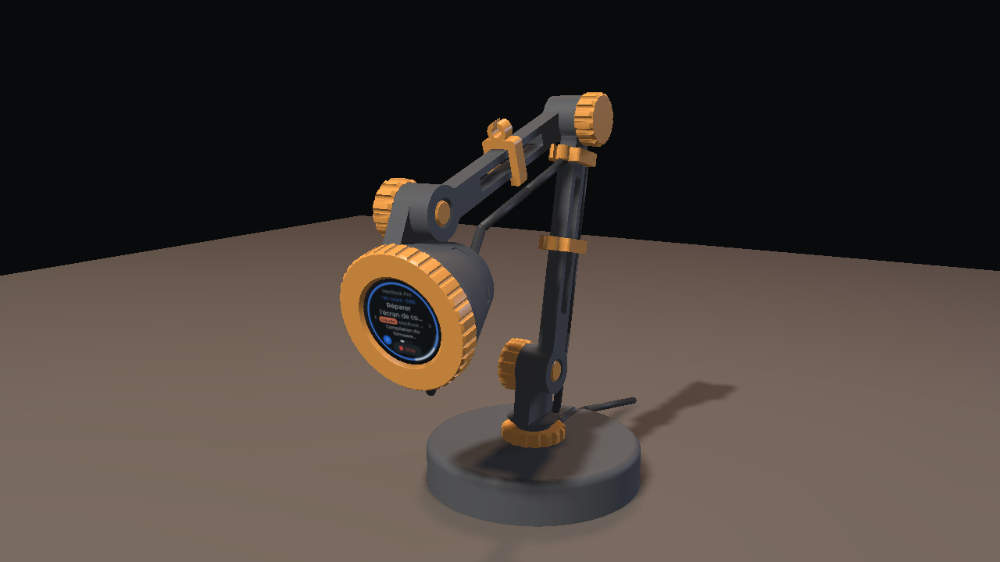

# Harness C3 — desk lamp / lampe de bureau



An articulated desk lamp whose **bulb is the dial**: the round
ESP32-2424S012C touch display sits in the head, looking at you. An original
design, generated by [`lamp.py`](lamp.py) (parametric, manifold-checked).
Assembly & setup video: [français](video/harness-c3-lamp-fr.mp4) ·
[English](video/harness-c3-lamp-en.mp4).

*Français plus bas.*

## Parts (13 prints, no supports)

| STL | qty | what | print as generated |
| --- | --- | --- | --- |
| `fit_coupon` | 1 | **print first**: the head's front 12 mm — board fit + bezel thread | flat |
| `base` | 1 | Ø100 foot: 8-rib ballast chamber, threaded bottom, M16 socket, cable channel | upright |
| `base_lid` | 1 | screws into the base, closes the ballast; 4 recesses for Ø10 rubber feet | flat |
| `shoulder` | 1 | M16×2 stud + fin (1st joint); swivels on the base | stud down |
| `jam_nut` | 1 | locks the shoulder's direction | flat |
| `lower_arm` | 1 | 115 mm, threaded hole at the shoulder end | flat |
| `upper_arm` | 1 | 105 mm, threaded both ends | flat |
| `knob` | 3 | friction-joint screws, 10×2 thread | head down |
| `head` | 1 | holds the board; USB-C window underneath | screen side down |
| `bezel` | 1 | screws onto the head, holds the glass rim (Ø34.4 window) | flat |
| `shim_1mm`, `shim_2mm` | 1+1 | take up board depth (C-shaped, USB side open) | flat |
| `cable_clip` | 3 | snap over the arms, hold the cable | flat |

`assembly_preview.stl` is the whole lamp posed (not for printing).

**Also needed**: an ESP32-2424S012C board (bare board, out of its shell if it
came in one), a **USB-A → USB-C** cable (the board has no CC resistors),
~150 g of ballast (steel balls, nuts, coins), optionally 4 rubber feet Ø10.

**Print**: PLA or PETG, 0.2 mm layers, 4 walls, 30 % infill (base: 40 %),
0.4 mm nozzle. Every thread has 45° flanks and 0.30 mm radial play (`FIT`).

## Fit check (5 minutes, before the big prints)

Print `fit_coupon` and `bezel`. The board must drop into the coupon freely
and the bezel must screw on by hand. Then adjust `lamp.py` and regenerate:

- threads too tight / loose → `FIT` (0.20–0.40);
- board tight / loose → `BOARD_D`;
- the board rattles behind the bezel → add a shim (1, 2 or both); if even
  that is not enough, lower `SEAT_Z`.

The board's 38.5 × 37 mm outline is published; its depth (glass to the back
of the USB-C socket) is **not**: `SEAT_Z = 9.5` is an estimate, the shims
are there for that.

## Assembly

1. **Base** — turn it over, fill the 8 chambers with ballast, screw the lid in.
2. **Shoulder** — thread the jam nut onto the stud *first* (from the tip, up
   to the collar), screw the stud into the base, aim the fin, spin the jam
   nut down onto the base to lock it.
3. **Lower arm** — lay it against the fin (its threaded end at the shoulder)
   and drive a knob through the fin into it.
4. **Elbow** — same with the upper arm: a knob through the lower arm into
   the upper arm's thread.
5. **Screen** — board into the head, **USB-C facing the window underneath**,
   shim if needed, screw the bezel on. Plug the cable in through the window.
6. **Head** — against the upper arm, last knob through the head's tab. Clip
   the cable along the arms, lay it in the base's top channel, out the back.

A knob tightened = the joint holds; loosened a quarter turn = it moves.
Then flash (web flasher) and plug into the computer running Harness — see
the main README.

## Regenerating

```sh
pip install manifold3d trimesh numpy
python3 lamp.py                  # → stl/*.stl + stl/assembly_preview.stl
```

Main parameters (top of `lamp.py`): arm lengths `L1`/`L2`, plate `T`,
`FIT`, `BOARD_D`, `SEAT_Z`, base size; `pose()` sets the preview angles.
The video: `video/make_video.py voice|render|compose` (pyrender + OSMesa,
Piper TTS, ffmpeg).

**Limits**: generated and checked in software (watertight parts, no
collisions in the assembled pose, male/female threads mesh at `FIT`), not
yet printed by me: do the fit check.

---

# Lampe de bureau (français)

Une lampe articulée dont **l'ampoule est le cadran** : l'écran rond tactile
de l'ESP32-2424S012C est dans la tête et vous regarde. Design original,
généré par [`lamp.py`](lamp.py). Vidéo de montage :
[français](video/harness-c3-lamp-fr.mp4) · [English](video/harness-c3-lamp-en.mp4).

**Pièces** : 13 impressions sans support (tableau ci-dessus) — pied, couvercle
de lest, épaule (tige M16), contre-écrou, bras inférieur 115 mm, bras
supérieur 105 mm, 3 molettes, tête, bague, 2 cales, 3 clips de câble, et la
pièce de test. **À prévoir** : la carte ESP32-2424S012C (nue, sortie de son
boîtier si elle en a un), un câble **USB-A → USB-C**, ~150 g de lest,
éventuellement 4 patins Ø10.

**Impression** : PLA ou PETG, couches 0,2 mm, 4 périmètres, remplissage 30 %
(pied : 40 %), buse 0,4. Filetages à flancs 45°, jeu radial 0,30 mm (`FIT`).

**Test d'ajustement d'abord** : imprimez `fit_coupon` et `bezel`. La carte
doit tomber dedans sans forcer, la bague se visser à la main. Sinon, réglez
`FIT` (filetages), `BOARD_D` (diamètre), et ajoutez des cales si la carte
bouge (la profondeur de la carte n'est pas publiée : `SEAT_Z = 9,5` est une
estimation). Puis `python3 lamp.py`.

**Montage** :

1. **Pied** — retournez-le, remplissez les 8 compartiments de lest, vissez le couvercle.
2. **Épaule** — vissez d'abord le contre-écrou sur la tige (par la pointe),
   vissez la tige dans le pied, orientez, bloquez avec le contre-écrou.
3. **Bras inférieur** — contre l'épaule (bout fileté côté épaule), une
   molette à travers l'épaule.
4. **Coude** — idem avec le bras supérieur.
5. **Écran** — carte dans la tête, **USB-C face à la fenêtre du dessous**,
   cale si besoin, vissez la bague ; branchez le câble par la fenêtre.
6. **Tête** — contre le bras supérieur, dernière molette. Clipsez le câble
   le long des bras, couchez-le dans la gorge du pied, sortie à l'arrière.

Molette serrée = l'articulation tient ; desserrée d'un quart de tour = elle
bouge. Ensuite : flasher (web flasher) et brancher sur l'ordinateur qui
fait tourner Harness.

**Limites** : pièces vérifiées par logiciel (étanches, aucune collision
assemblée, filetages qui s'engagent au jeu `FIT`), pas encore imprimées de
mon côté — faites le test d'ajustement.
